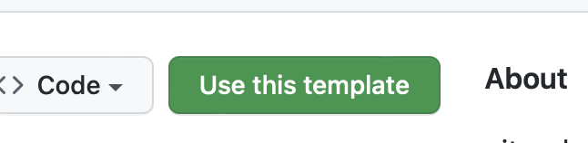
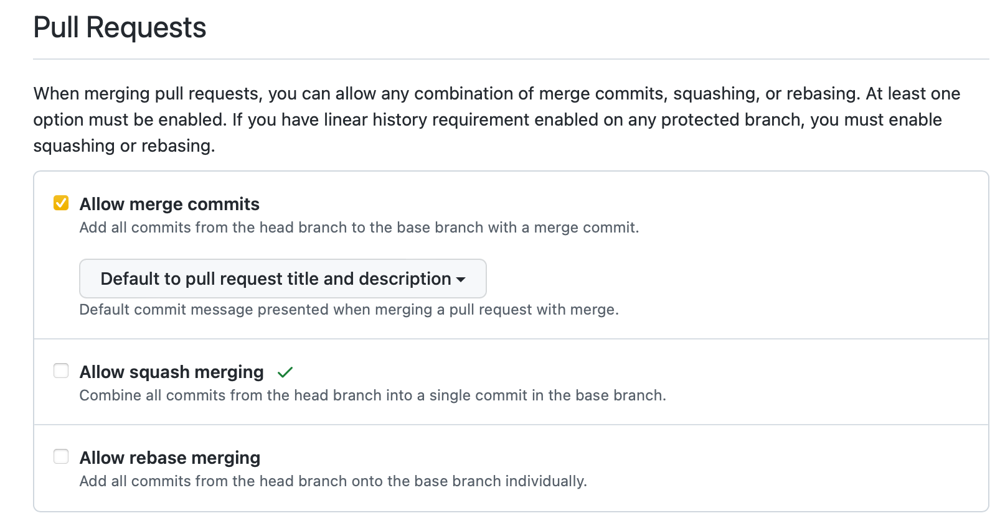

# python_boilerplate

This repo contains a GitHub template for a complete Python project with support for:

- using virtual environments
- using separate requirements files for project and dev dependencies
- installing the project as a local _editable_ package to easily import it in any test
  file without having to use `sys.path.append()`
- efficiently working in [Gitpod](https://gitpod.io) with a pre-configured
  [`gitpod.yml`](.gitpod.yml) file and pre-builds
- using [black](https://black.readthedocs.io/en/stable/) for code formatting
  manually and/or via [pre-commit](https://pre-commit.com) and/or with a GitHub
  Actions workflow that checks the code formatting at each push and pull-request on the
  `main` branch.
- using GitHub actions workflows to:
  - parse the title of each pull request on the `main` branch and extract new version
    number (`v*.*.*`)
  - check that the [`CHANGELOG.md`](CHANGELOG.md) file has been updated with the new
    version number
  - check that the [`setup.py`](setup.py) file has been updated with the new version number
  - create a git tag on `main` once the pull-request is merged

This is a list of the current features implemented, more will come with time.

## How to use this template

1. Click on the `Use this template` button on the GitHub page of this repo to create
   a new repo.

Don't check the "Include all branches" option.
Once the repo is created, go in the repo settings and to the Pull requests section
to choose this option:

2. Once you cloned the repo, you can rename the `python_boilerplate` package in the
   `setup.py` file and the `python_boilerplate` folder. In PyCharm, you can just
   rename the first one and it will automatically rename the folder. You can also
   modify the other fields in the `setup.py` file, delete the `images` folder and
   the content of the `README.md` and `CHANGELOG.md` files. You can then add your
   files and start working on your project.

3. To install all the dependencies you can use the [`setup_workspace.sh`](scripts/setup_workspace.sh)
   script. It will create a virtual environment, install the project as an editable
   package and install the regular and dev dependencies, and install black and pre-commit.
   > If you use Gitpod, you don't need to run this script, it is already done for you.
